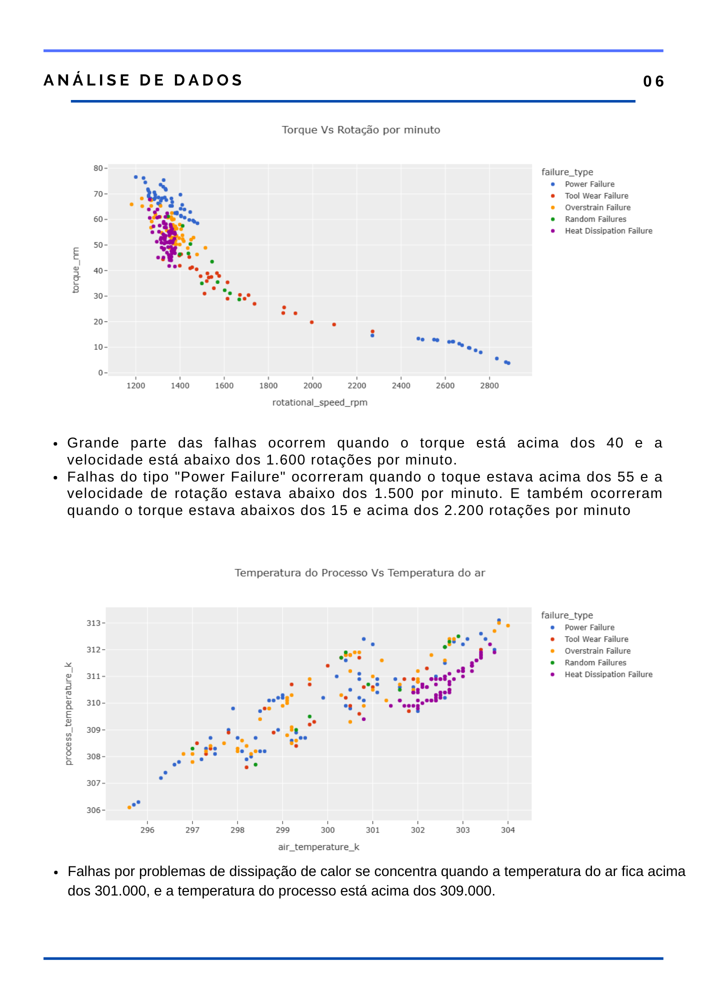

# Documentação do Projeto de Manutenção preventiva
Projeto de ciência de dados, onde o objetivo é identificar quais máquinas apresentam potencial de falha tendo como base dados extraídos através de sensores durante o processo de manufatura.

